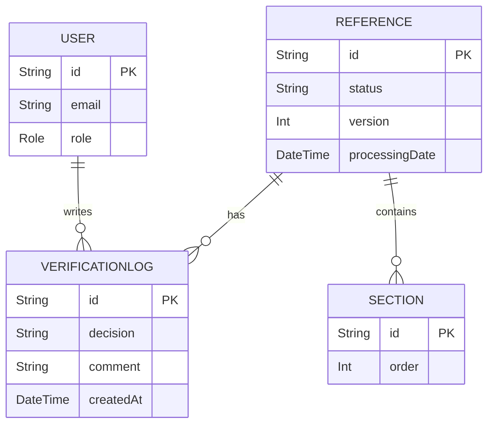
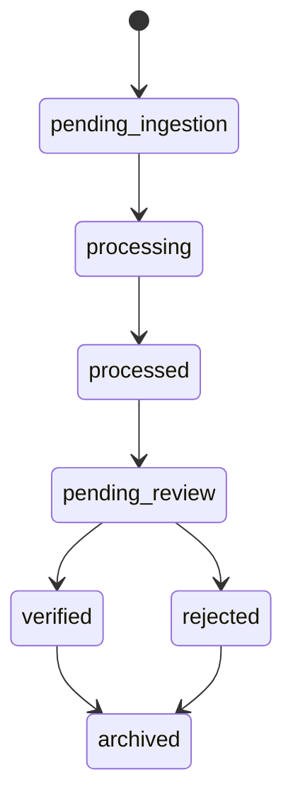

# Architecture Master Document

This document codifies the architecture of the **Medical Content Platform**. The text below has been reconstructed from the current repository and is intended to serve as the single source of truth for all team members.

---

## 1. Project Identity & Core Principles

**Mission**: Build a **Governed Multi-Source Knowledge Aggregation & Verification Infrastructure**. The system ingests documents from diverse sources, breaks them into searchable sections, and puts every piece of content under an auditable governance process that is centered on the `Reference` entity.

Core principles:

1. **Governance at the Reference level** – a Reference is the atomic unit of review, not its individual sections.
2. **Append‑only history** – any change, especially in verification, is recorded via log tables (e.g. `VerificationLog`).
3. **Separation of concerns** – layers are cleanly divided (UI → API → service logic → state machine → database) and interactions are mediated through well‑defined contracts.
4. **Test‑first safety** – every feature is accompanied by unit and integration tests; regressions are caught early.
5. **Transparency & traceability** – state transitions and data mutations occur in explicit transactions, with indexes to support efficient queries.

---

## 2. Architectural Layers & Folder Structure

The codebase is organized into layers that map directly to folders.

| Layer           | Purpose & Responsibilities                                   | Key directories/files                         |
|----------------|--------------------------------------------------------------|----------------------------------------------|
| **UI**         | Presentational React components, pages, navigation.          | `pages/` (Next.js), `pages/admin/`, `pages/devices/`, `pages/workshop/`.
| **API**        | HTTP endpoints, request validation, auth middleware.        | `pages/api/` and subfolders (e.g. `admin/`, `content/`, `planner/`, `references/`).
| **Service**    | Business logic reused by APIs and CLI tools.                 | `lib/services/` (e.g. `MetricsService.js`), `lib/workers/` (ingestion/process logic), `lib/adminAuth.ts`, `lib/env.ts`, `lib/logger.ts`, `lib/prisma.ts`.
| **State Machine** | Background processes and pipelines drive status changes. | `lib/workers/ingestionWorker.ts`, `tools/` scripts such as `reextract_sections.js`.
| **Database**   | Persistent storage defined via Prisma schema.               | `prisma/schema.prisma`, `prisma/migrations/`.
| **Tests**      | Unit/Integration/E2E ensuring correctness.                  | `__tests__/` plus helpers and mocks under same.
| **Scripts/Tools** | CLI utilities for maintenance and data operations.       | `tools/show_project_metrics.js`, `tools/reextract_sections.js`, `scripts/`.

Each layer interacts only with the one immediately below it; for example, UI pages call APIs but not services directly, while services access the Prisma client.

---

## 3. Core Services & API Contracts

### 3.1 Acquisition & Ingestion Services
- **Scraper/Import**: Runs outside of the web UI (`scripts/scrape_fda.js`, `tools/reextract_sections.js`). Produces `Reference` records and associated `Section` entries through the ingestion worker.
- **Ingestion Worker** (`lib/workers/ingestionWorker.ts`): Implements the reference lifecycle transitions from `pending_ingestion` → `processing` → `processed` and appends `IngestionLog` entries on errors.

### 3.2 Governance Services
Governance revolves around `Reference` status changes and verification logs.

#### Endpoints

1. **GET /api/admin/references/queue**
   - **Request**: none
   - **Response**: `[ { id, deviceId, title, status, uploadedAt, ... } ]` for `status = 'pending_review'`

2. **GET /api/admin/references/[id]**
   - **Request**: query param `id` (string)
   - **Response**: full `Reference` object including `sections: Section[]` and metadata.

3. **GET /api/admin/references/[id]/sections**
   - **Request**: query param `id` (string)
   - **Response**: `Section[]` associated with the reference; read‑only view.

4. **POST /api/admin/verification/[id]**
   - **Request body**: `{ decision: 'verified' | 'rejected', comment?: string }`
   - **Behavior**: Transactionally updates `Reference.status`, increments `version`, sets `processingDate`, and inserts a `VerificationLog` record with `reviewerId` from session.
   - **Responses**:
     - `200 OK` with `{ status: newStatus }` on success
     - `409 Conflict` if the reference is no longer in `pending_review`
     - `500` on server error

5. **GET /api/admin/metrics**
   - **Response**: `{ deviceCount, articleCount, sectionCount }` computed by `MetricsService`.

Other ancillary endpoints cover ingestion control (`/api/admin/ingestion/import`, `/api/admin/ingestion/run-worker`), library search, planner, etc., but they conform to the same pattern: simple JSON APIs guarded by `withAdminAuth` when necessary.

### 3.3 Utility Services
- **MetricsService** (`lib/services/MetricsService.js`): Provides a single `computeMetrics(prisma?)` method used by both CLI and API.
- **Admin Auth Middleware** (`lib/adminAuth.ts`): Wraps handlers to enforce session and role checks.

---

## 4. Database Model
The Postgres schema is defined in Prisma. Below are the core tables relevant to governance:

```prisma
model User {
  id        String   @id @default(cuid())
  email     String   @unique
  name      String?
  password  String
  role      Role     @default(editor)
  createdAt DateTime @default(now())
  updatedAt DateTime @updatedAt
  devices   Device[]
  verificationLogs VerificationLog[]
}

enum Role {
  admin
  reviewer
  editor
}

model Reference {
  id              String           @id @default(cuid())
  device          Device           @relation(fields: [deviceId], references: [id])
  deviceId        String
  title           String
  filePath        String?
  sourceUrl       String?
  sourceName      String?
  sourceId        String?
  sourceReliabilityScore Float? @default(0.0)
  parsedText      String?
  pageCount       Int?
  status          ReferenceStatus @default(pending_ingestion)
  // version is a content version counter; it increments when a reference is re‑processed or re‑extracted, not during normal verification transitions.
  uploadedAt      DateTime         @default(now())
  version         Int              @default(1)
  processingDate  DateTime?
  knowledgeChunks KnowledgeChunk[]
  sections        Section[]
  ingestionLogs   IngestionLog[]
  verificationLogs VerificationLog[]

  @@index([status])
  @@index([uploadedAt])
}

enum ReferenceStatus {
  pending_ingestion
  processing
  processed
  pending_review
  verified
  rejected
  archived  // terminal administrative state; not active in any automated workflow. Use requires explicit architectural approval.
}

model Section {
  id          String        @id @default(cuid())
  device      Device        @relation(fields: [deviceId], references: [id])
  deviceId    String
  reference   Reference     @relation(fields: [referenceId], references: [id])
  referenceId String
  title       String
  content     String        @db.Text
  order       Int
  createdAt   DateTime      @default(now())
}

model VerificationLog {
  id          String    @id @default(cuid())
  reference   Reference @relation(fields: [referenceId], references: [id])
  referenceId String
  reviewer    User      @relation(fields: [reviewerId], references: [id])
  reviewerId  String
  decision    String
  comment     String?
  createdAt   DateTime  @default(now())

  @@index([referenceId])
  @@index([reviewerId])
}
```

Other tables (`Device`, `KnowledgeChunk`, etc.) support the broader platform but are peripheral to governance.

---

## 5. Testing Strategy

The project enforces quality through three tiers:

1. **Unit Tests** – Located under `__tests__/` with filenames matching the unit under test. We mock dependencies (Prisma, pdf parsing, file I/O) to verify isolated functions such as `MetricsService.computeMetrics` or `reextractAll`. Jest is the test runner; examples include `show_project_metrics.test.ts` and `reextract_sections.test.js`.

2. **Integration/API Tests** – Also in `__tests__`, these spin up the API handlers via `node-mocks-http` and assert HTTP behaviour. Authentication is faked with `jest.mock('next-auth/next')`. Entire flows, such as the verification API or library search, are exercised.

3. **UI/End‑to‑End Tests** – React Testing Library is used for components and pages (`admin_dashboard.test.tsx`, `home.test.tsx`). (E2E browser automation is not yet implemented but should be added before production releases.)

Environment configuration is validated at runtime; missing values during tests log warnings but do not fail the suite.

All tests must pass before any merge; CI runs `npm test --runInBand --detectOpenHandles` to catch leaks.

---

## 6. Architecture Compliance Rules

To preserve the integrity of the architectural blueprint, the following rules are mandatory:

### 6.1 Proposal Process
- Any feature that modifies data flows, lifecycle transitions, or adds new endpoints must be documented in an **Architecture Change Request (ACR)** stored in the repo (e.g. `docs/acr-*.md`).
- The ACR must describe:
  - The motivation and user story.
  - Impacted layers/folders.
  - Schema changes or new enums.
  - API contract changes (request/response examples).

### 6.2 Review Checklist
An architectural review consists of verifying:
- ✅ Does the change respect the UI→API→Service→Database boundaries?
- ✅ Are new data models normalized and indexed appropriately?
- ✅ Is the Reference still the single governance unit? (see 6.4)
- ✅ Are transactions used when multiple tables are altered? Will logs record the change?
- ✅ Are tests added/updated at all three tiers?
- ✅ Will the change affect performance or require new indexes?
- ✅ Is there documentation (this document, README, or API spec) updated?

### 6.3 Definition of Architectural Regression
An architectural regression occurs when code reintroduces any of the following:
- Bypassing the service layer from UI pages.
- Adding new cross‑cutting concerns (e.g. global state) without explicit team approval.
- Hard‑coding database credentials or bypassing Prisma.
- Breaking any existing public API contract without a documented deprecation strategy.

### 6.4 Lifecycle Logic Approval Flow
Any modification to the `Reference` lifecycle (enum values, allowed transitions, processing dates, versioning) must be:
1. Drafted in an ACR with state diagrams.
2. Approved by **two team members**, one of whom must be a reviewer or admin role.
3. Merged only after passing a CI build with additional regression tests verifying both old and new transitions.
4. Announced in the team channel with a link to the updated ARCHITECTURE_MASTER_DOCUMENT.md.

These rules are enforced by the Technical Supervisor prior to any branch merging.

---

## 7. Visual Formalization

### 7.1 Entity-Relationship Diagram (ERD)



### 7.2 Reference Lifecycle State Diagram



### 7.3 Verification Flow Sequence Diagram

```mermaid
sequenceDiagram
    participant UI
    participant API
    participant DB
    participant Worker

    UI->>API: POST /api/admin/verification/{id} {
        decision, comment
    }
    API->>DB: begin transaction
    DB-->>API: lock reference row
    API->>DB: update Reference.status, processingDate
    API->>DB: insert VerificationLog
    DB-->>API: commit
    API-->>UI: 200 OK / 409 Conflict
```

(Worker represents any background process that may react to the new status, e.g. cache invalidation.)

---

## 8. Formal Declaration & Review Gate

**We, the development team, have reconstructed, understood, and formally accept the `ARCHITECTURE_MASTER_DOCUMENT.md` as the single source of truth for all future development.**

We explicitly reaffirm:

- The Reference entity is the sole unit of governance. Section‑level governance is deprecated and will not be implemented.
- All lifecycle changes must follow the approval flow (see §6.4).

No work on Phase 4 (The Internal Governance Dashboard) or any other feature will begin until this document has been committed and explicit architectural approval granted by the Technical Supervisor.

### Ambiguities / Discussion Points

- **E2E testing framework**: current suite uses React Testing Library but lacks browser automation. This should be discussed prior to Phase 4.
- **Archival policy**: the `archived` state exists but business rules for moving there are not codified.

Once signed off, this file will anchor the team's process and design decisions.

---

*Document generated: 2026‑03‑04*