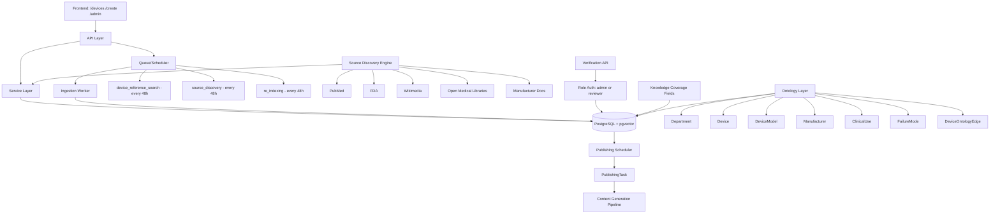

# System Flowchart After Update
Date: 2026-03-06

```mermaid
flowchart TD
  A[Frontend: /devices /create /admin] --> B[API Layer]
  B --> C[Service Layer]
  C --> D[(PostgreSQL + pgvector)]

  B --> Q[Queue/Scheduler]
  Q --> W[Ingestion Worker]
  W --> D

  Q --> R1[device_reference_search - every 48h]
  Q --> R2[source_discovery - every 48h]
  Q --> R3[re_indexing - every 48h]

  SD[Source Discovery Engine] --> S1[PubMed]
  SD --> S2[FDA]
  SD --> S3[Wikimedia]
  SD --> S4[Open Medical Libraries]
  SD --> S5[Manufacturer Docs]
  SD --> C

  V[Verification API] --> AUTH[Role Auth: admin or reviewer]
  AUTH --> D

  KC[Knowledge Coverage Fields] --> D
  D --> P[Publishing Scheduler]
  P --> PT[PublishingTask]
  PT --> G[Content Generation Pipeline]

  O[Ontology Layer] --> O1[Department]
  O --> O2[Device]
  O --> O3[DeviceModel]
  O --> O4[Manufacturer]
  O --> O5[ClinicalUse]
  O --> O6[FailureMode]
  O --> O7[DeviceOntologyEdge]
  O --> D
```
